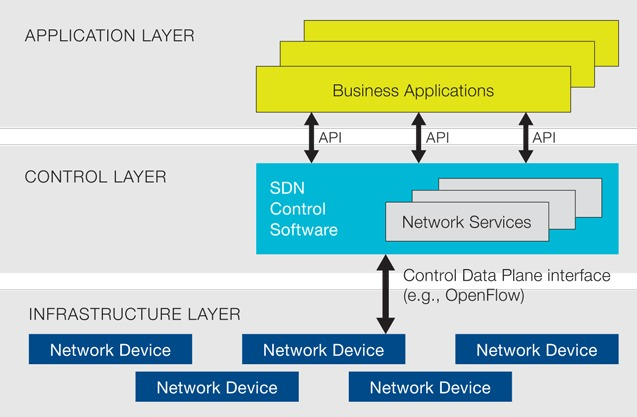

!SLIDE
# SDN

«Software Defined Networking»

Découpage en 2 :

* «control plane»
* «data plane»

!SLIDE full

!SLIDE
# Intérêt du SDN

* Déployer le plan de contrôle avec plus de capacités
* Indispensable pour la virtualisation / cloud (multitenant)

!SLIDE
# OpenFlow

Géré par la  «Open Networking Foundation»

https://www.opennetworking.org/

!SLIDE
# OpenFlow

OpenFlow est le protocole de communication le plus avancé :

* OpenFlow Switch Specification 1.3.1  (2012/09/06)
* OpenFlow Configuration and Management Protocol 1.1.1 (2013/03/21)

!SLIDE
# OpenFlow

Implémenté par Google, Cisco, Juniper, HP, NEC...

https://www.opennetworking.org/sdn-resources/sdn-openflow-product-availability

!SLIDE
# Avantages du SDN

* Vue unifiée
* Programmable
* Meilleure gestion des ressources (95% chez Google)
* Meilleure gestion des erreurs
* Time to market plus élevé
* Upgrade logiciel moins impactant
* Elasticité
* Facilité pour tester (émulation du réseau)
